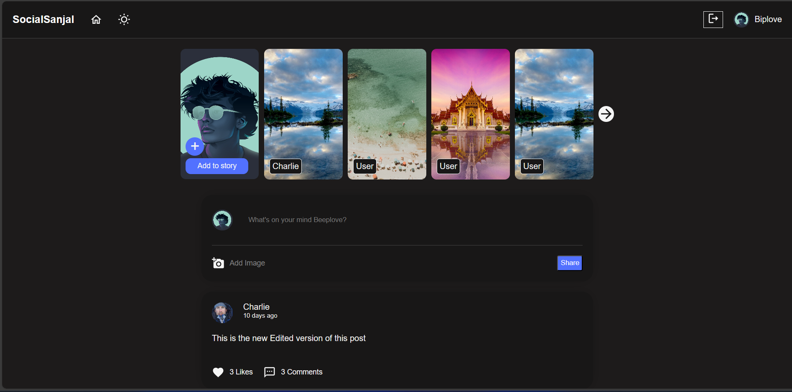
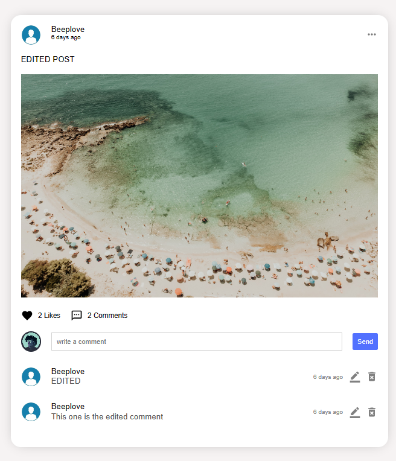

# SocialSanjal

A streamlined social media platform, taking inspiration from popular platforms like Instagram, but with a simplified touch. Developed using the MERN stack, the app offers essential features tailored to deliver a smooth user experience.

 
 

## Features

- **Enhanced Security**:
  - **JWT Authentication**: Securely manage user sessions and ensure data integrity.
  - **Password Security**: Passwords are hashed using bcrypt, ensuring user credentials are stored securely.
  
- **User Management**:
  - Register, log in, and log out capabilities.
  - Ability to change password and delete accounts.

- **Posts**:
  - Users can share posts with or without pictures.
  - Posts can be liked and commented upon.
  - Edit and delete functionality for users' own posts and comments.

- **Story Feature**: Users can share stories using pictures.

- **Profile & Social Interaction**:
  - View and edit user profiles.
  - Follow and unfollow other users.
  - View lists of followers and following.

- **Design & Responsiveness**:
  - Developed using the SCSS framework alongside React.
  - A user-friendly dark theme for enhanced readability and reduced eye strain during nighttime browsing.
  - The current design is desktop-focused. Responsiveness enhancements are planned for future releases.

## Technologies Used

- **Frontend**: React (with SCSS)
- **Backend**: Node.js with Express
- **Database**: MongoDB
- **Authentication**: JSON Web Tokens (JWT)
- **Password Hashing**: bcrypt

## Installation & Setup

1. Clone the repository: `git clone https://github.com/BabaYaGa74/SocialMediaApp.git`
2. Navigate to the directory: `cd SocialMediaApp`
3. Install the dependencies: `npm install`
4. Start the development server: `npm start`

**Note**: Ensure you have set up the environment variables for MongoDB, JWT and VITE_API_ENDPOINT

## Future Enhancements

- Mobile responsiveness to cater to a broader audience.
- More interactive features to increase user engagement.

---
